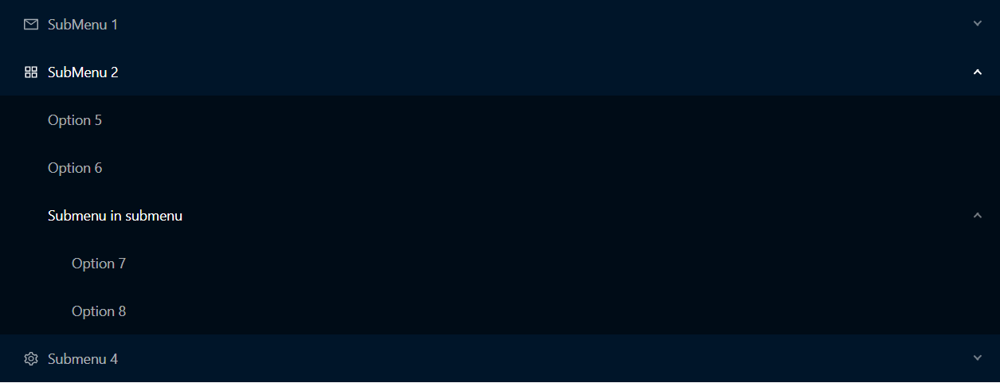
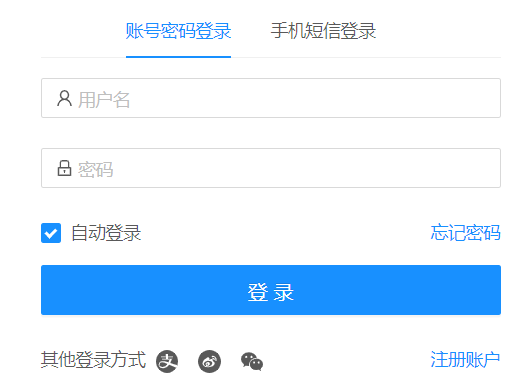

# React Note

## 1. 环境配置

### 1.1 安装 Node 与 NPM

前往[中国镜像站下载 Node.js](http://nodejs.cn/download/)并安装。

### 1.2 安装 `create-react-app`

`npm i -g create-react-app`

### 1.3 创建项目

`create-react-app project`

## 2. React Router

### 2.1 安装

`npm i -S react-router-dom`

### 2.2 配置导航

#### 2.2.1 配置路由

```jsx
// 路径: /src/router/index.js

import React from 'react';
import { Route, Switch } from 'react-router-dom';
import Home from '../pages/Home';
import Login from '../pages/Login';
import Register from '../pages/Register';

export const Router = () => (
  <Switch>
    <Route exact path="/" component={Home} />
    <Route exact path="/login" component={Login} />
    <Route exact path="/register" component={Register} />
  </Switch>
);

export default Router;
```

#### 2.2.2 引用路由

```jsx
// 路径: /src/App.js

import React from 'react';
import { BrowserRouter } from 'react-router-dom';
import Router from './router/index';

function App() {
  return (
    <BrowserRouter>
      <Router></Router>
    </BrowserRouter>
  );
}

export default App;
```

别忘了创建路由中指定的相关组件，本例中为 `<Home>`、`<Login>` 及 `<Register>`。

### 2.3 配置详解

#### 2.3.1 Switch

渲染第一个被 `location` 匹配到的 `<Route>` 子元素或 `<Redirect>` 子元素。

存在 `<Switch>` 标签，若其中有 `<Route>` 重复，则进行顺序匹配，只匹配第一个；若不存在 `<Switch>` 标签则渲染全部。

> 一个有用的特性，可以用于构建 sidebar 等，甚至实现类似于旁路由的功能。

#### 2.3.2 Route

`<Route>` 有一个名为 `exact` 的属性，意为“精准匹配”，类似于 Angular Router 的 `pathMatch='full'`。只有当**页面路径**与**路由路径**完全匹配时该，该 `<Route>` 才会被渲染。

## 3. Ant Design

### 3.1 安装

`npm i -S antd`

官方文档见 <https://ant.design/>

### 3.2 启用预处理器

#### 3.2.1 安装

`npm i -D react-app-rewired customize-cra babel-plugin-import less-loader`

#### 3.2.2 更换启动命令

将 `package.json` 中的 `scripts` 命令中的 `react-scripts` 替换为 `react-app-rewired`。

#### 3.2.3 配置 `config-overrides.js`

在项目根目录创建 `config-overrides.js`，并添加如下代码：

```js
const { override, addLessLoader, fixBabelImports } = require('customize-cra');

module.exports = override(
  fixBabelImports('antd', {
    librarayDirectory: 'es',
    style: 'css',
  }),
  addLessLoader({
    lessOptions: {
      javaScriptEnabled: true,
    }
  })
);
```

#### 3.2.4 使用 less 模块化导入

```jsx
// 样式模块，与常规样式文件相同
.menu { width: 300px; }

// 导入样式模块，仅仅供本组件使用
import styles from './Component.module.less';

// 使用方式同对象
<div className={styles.menu}></div>
```

### 3.3 组件 Menu 导航菜单

官方文档：<https://ant.design/components/menu-cn/>

该组件主要有四个常用元素，`<Menu>`、`<SubMenu>`、`<Menu.Item>`以及`<Menu.ItemGroup>`。

#### 3.3.1 语法

```jsx
<Menu theme mode defaultSelectedKeys={['1']} defaultOpenKeys={['sub1']}>
    <SubMenu key icon title></SubMenu>
    <Menu.ItemGroup key icon title></Menu.ItemGroup>
    <Menu.Item key icon title></Menu.Item>
</Menu>
```

#### 3.3.2 示例

```jsx
import { AppstoreOutlined, MailOutlined, SettingOutlined } from '@ant-design/icons';
import { Menu } from 'antd';
import SubMenu from 'antd/lib/menu/SubMenu';
import React from 'react';

export function Home() {
  return (
    <Menu
      theme="dark"
      mode="inline"
    >
      <SubMenu
        key="sub1"
        title={
          <span>
            <MailOutlined />
            <span>SubMenu 1</span>
          </span>
        }
      >
        <Menu.ItemGroup key="sub1group1" title="Item Group 1">
          <Menu.Item key="1">Option 1</Menu.Item>
          <Menu.Item key="2">Option 2</Menu.Item>
        </Menu.ItemGroup>
        <Menu.ItemGroup key="sub2group2" title="Item Group 2">
          <Menu.Item key="3">Option 3</Menu.Item>
          <Menu.Item key="4">Option 4</Menu.Item>
        </Menu.ItemGroup>
      </SubMenu>
      <SubMenu
        key="sub2"
        icon={<AppstoreOutlined />}
        title="SubMenu 2"
      >
        <Menu.Item key="5">Option 5</Menu.Item>
        <Menu.Item key="6">Option 6</Menu.Item>
        <SubMenu key="sub3" title="Submenu in submenu">
          <Menu.Item key="7">Option 7</Menu.Item>
          <Menu.Item key="8">Option 8</Menu.Item>
        </SubMenu>
      </SubMenu>
      <SubMenu
        key="sub4"
        icon={<SettingOutlined />}
        title="Submenu 4"
      >
        <Menu.Item key="9">Option 9</Menu.Item>
        <Menu.Item key="10">Option 10</Menu.Item>
        <Menu.Item key="11">Option 11</Menu.Item>
        <Menu.Item key="12">Option 12</Menu.Item>
      </SubMenu>
    </Menu>
  );
}

export default Home;
```

#### 3.3.3 效果图



### 3.4 组件 Tabs 标签页

官方文档：<https://ant.design/components/tabs-cn/>

该组件常用两个元素，`<Tabs>` 以及 `<TabPane>`。

#### 3.4.1 语法

- `tabBarExtraContent` 右侧的操作按钮
- `size` 有三种，`small || default || large`
- `tabPosition` 有四种，`left || right || top || bottom`，移动端只有上下
- `type` 可用 `card` 模式

```jsx
<Tabs
    defaultActiveKey
    centered
    size
    tabPosition
    closable
    type
    tabBarExtraContent
    onChange
    onEdit
    ></Tabs>
<TabPane tab key disabled></TabPane>
```

#### 3.4.2 示例

```jsx
// 导入
import { Tabs } from 'antd';

// 使用样例
export function Login() {
  return (
    <div>
      <Tabs defaultActiveKey="1" centered>
        <Tabs.TabPane tab="账号密码登录" key="1">
          Tab1
        </Tabs.TabPane>
        <Tabs.TabPane tab="手机短信登录" key="2">
          Tab2
        </Tabs.TabPane>
      </Tabs>
    </div>
  );
}
```

#### 3.4.3 效果图



### 3.5 组件 Input 输入框

官方文档：<https://ant.design/components/input-cn/>

常用的元素有 `<Input>` 和 `<TextArea>`

#### 3.5.1 语法

- `size` 可用选项 `large || small`，默认为空
- `iconRender` 常使用此表达式 `visible => (visible ? <EyeTwoTone /> : <EyeInvisibleOutlined />)`

```jsx
<Input
    size
    addonBefore
    addonAfter
    prefix
    suffix
    defaultValue
    placeholder
    loading
    enterButton
    allowClear
    value
    />
<Input.Password
    placeholder
    iconRender
    />
<TextArea
    autoSize
    placeholder
    allowClear
    value
    />
```

样例等请详见官方文档。

### 3.6 表单 Form

官方文档：<https://ant.design/components/form-cn/>

常用元素 `<Form>`、`<Form.Item>`

#### 3.6.1 语法

- `validateMessages` 验证之后的提示信息
- `validateStatus` 验证状态

```jsx
<Form
    name
    onFinish
    onFinishFailed
    validateMessages
    >
 <Form.Item
        label
        name
        rules
        validateStatus
        hasFeedback
        help
        ></Form.Item>
</Form>
```

#### 3.6.2 基本用法

```jsx
// 获取表单中的项
const [form] = Form.useForm();

// 获取姓名项
form.getFieldValue('name');
// 验证
form.validateFields(['name', 'mail']);
// 获取错误信息
form.getFieldError('name');
// 重设表格
form.resetFields(['name', 'mail']);
// 提交表格
form.submit();
// 跳转到表单项
form.scrollToField('name');
```

#### 3.6.3 表单验证

1. 配置验证提示内容

   ```jsx
   /** 首先配置 validate message，将会在验证通过或失败时显示 */
   const validateMessages = {
     required: '${label} is required!',
     types: {
       email: '${label} is not validate email!',
       number: '${label} is not a validate number!',
     },
     number: {
       range: '${label} must be between ${min} and ${max}',
     },
   };
   ```

2. 配置验证规则

   ```jsx
   const rules = [
       {
           required: true, // 必填项
           type: 'email', // 类型为邮箱
           min: 3, // 最小长度
           max: 100 // 最大长度
       }
   ];
   ```

#### 3.6.4 自定义验证

1. 自定义验证函数

   ```jsx
   function check(event, value) {
     const password = form.getFieldValue('password');
     const confirm = form.getFieldValue('confirm');
     return (confirm && password && confirm === password)
       ? Promise.resolve()
       : Promise.reject('两次输入的密码不匹配');
   };

   // 引用
   <Input rules={[ { validator: check } ]} />
   ```

2. 手动验证

   ```jsx
   const [form] = Form.useForm();

   const bindCheck => () => {
       form.validateFields(['confirm', 'password']);
       return Promise.resolve();
   };
   ```

### 3.7 组件 Grid 栅格

官方文档：<https://ant.design/components/grid-cn/>

常用`<Row>` 与`<Col>` 元素，以 24 为一行的总数。

#### 3.7.1 语法

- `gutter` 各个 `<Col>` 的间隔
- `span` 每个 `<Col>` 所占的空间，一行共有 24 个可分配单位

```jsx
<Row gutter>
 <Col span></Col>
</Row>
```

#### 3.7.2 样例

```jsx
// 在不同设备上的间隔不同
<Row gutter={{ xs: 8, sm: 16, md: 24, lg: 32 }}>
    <Col span={12}>1</Col>
    <Col span={6}>2</Col>
    <Col span={6}>3</Col>
</Row>
```

### 3.8 组件 CheckBox 多选框

官方文档：<https://ant.design/components/checkbox-cn/>

#### 3.8.1 语法

```jsx
<Checkbox.Group
    indeterminate
    >
    <Checkbox
        checked: boolean
        defaultChecked: boolean
        defaultValue
        disabled
        value
        >
        勾选内容
    </Checkbox>
</Checkbox.Group>
```

### 3.9 组件 Popover 气泡卡片

官方文档：<https://ant.design/components/popover-cn/>

鼠标移入或点击元素，弹出气泡式的卡片浮层，如注册时的密码强度浮层。

#### 3.9.1 语法

- `content` 浮层内容
- `title` 浮层标题
- `trigger` 触发方式，三种：`hover || focus || click`

```jsx
<Popover
    content: Element
    title: string
    trigger: 'hover' || 'focus' || 'click'
    visible: boolean
    >
 <div>原本的元素</div>
</Popover>
```

### 3.10 组件 Select 选择器

官方文档：<https://ant.design/components/select-cn/>

下拉选择器，常用元素 `<Select>`、`<Select.Option>`

#### 3.10.1 语法

- `showSearch` 显示搜索按钮
- `optionFilterProp` 从何处搜索

```jsx
<Select
    defaultValue: string
    showSearch: boolean
    placeholder: string
    optionFilterProp: 'children'
    >
 <Option
        value: string
        disabled: boolean
        title: string
        >选项一</Option>
</Select>
```

## 4. 其他知识点

### 4.1 useEffect 处理倒计时

```jsx
export function test() {
  /** 是否在等待网络响应 */
  const [waiting, setWaiting] = useState(false);
  /** 60 秒倒计时 */
  const [count, setCount] = useState(0);

  /** 等待网络响应或处于倒计时中 */
  useEffect(() => {
    setTimeout(() => count > 0 && setCount(count - 1), 1000);
  }, [count]);
}
```

### 4.2 NPM 版本号的区别

`^` Major 主版本锁定、`~` Minor 从版本锁定、空前缀 Patch 小版本锁定

### 4.3 自定义配置

使用 `npm run eject` 暴露 React 的 WebPack 配置，从而实现自定义配置等

### 4.4 获取子组件

在组件中使用 `children` 获取子组件，如下代码所示：

```jsx
/** App Component */
export function App() {
  return (
    <Button>Hello</Button>
  );
}

/** Button Component */
export function Button({ children }) {
  return (
    <button>{children}</button>
  );
}
```

### 4.5 使用解构的方式向组件传值

```jsx
// Input Component
export function Input(props) {
    return (
     <input {...props} />
    );
}

// App Component
export function App() {
    return (
     <div>
         <Input placeholder="解构传值" disabled />
        </div>
    );
}
```
